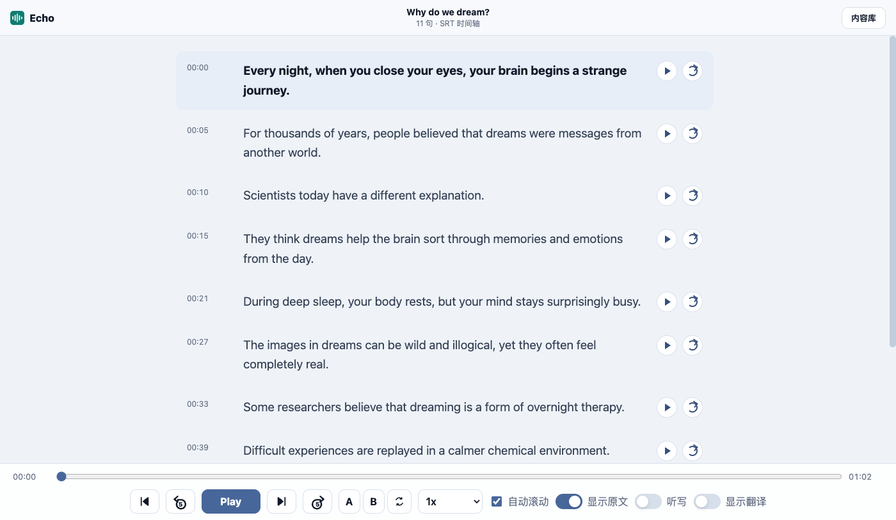

# Echo — 自托管英语精听播放器

一个极简、自托管、移动端友好的通用英语音频精听平台（由开源项目 cet-listening 改造而来）。核心输入是 `MP3 + 同名 .srt`：把文件放进 `library/` 目录，服务器实时扫描识别，即可逐句精听。支持逐句播放、原文高亮、单句循环、倍速、快捷键；界面为字幕优先的沉浸式布局，明暗主题跟随系统。

仓库中的历史 CET-6 材料（37 套）保留作档案，但播放器不再加载；内容来源完全由 `library/` 目录决定。



## 功能特性

- 内容库浏览：点击右上角「内容库」打开抽屉，按 来源 → 合集 → 条目 三层树展示 `library/` 中的内容，分组可折叠，支持按标题/来源搜索。
- 音频播放：支持播放/暂停、进度条拖动、前进/后退 5 秒、上一句/下一句（`[` `]` 快捷键）。
- 倍速：0.5x–2x 预设下拉 + 自定义倍速（0.25–4），选择自动记忆。
- A-B 循环：设定 A/B 两点区间循环（A/B 快捷键），适合卡点精听。
- 句级时间轴：SRT 字幕按句拆分并显示开始时间，播放时自动高亮当前句。
- 逐句精听：每一句右侧都有播放按钮，点击即可跳到该句并播放。
- 单句循环：每一句都支持单独循环播放，适合跟读、听写和卡点复听。
- 听写模式：一键隐藏全文，逐句点击播放、输入听写；系统按词批改（大小写/标点容错），全对自动揭示并进入下一句，错词标红提示。
- 自动滚动：播放时自动把当前句滚动到视野中心，可随时关闭。
- 原文开关：可隐藏/显示听力原文，用于盲听或复盘。
- 翻译开关：如果对应数据里带有 `translation` 字段，可以一键显示/隐藏中译。
- 段落导航：内容库抽屉内按段落跳转。
- 沉浸式界面：顶栏（品牌 + 当前标题）+ 全屏字幕阅读列 + 底部固定播放条；明暗主题跟随系统自动切换，也可用顶栏主题按钮手动锁定（自动/亮/暗）；移动端播放控件收入拇指区。
- 断点续看：会自动恢复上次打开的内容、播放进度、列表滚动位置和原文滚动位置。
- 分享定位：URL 支持 `?track=<id>` 形式，方便直接打开指定内容。
- 音频 Range 支持：本地 Python 服务支持浏览器分段请求，拖动进度条和大音频播放更稳定。

## 技术栈

- 前端：原生 HTML、CSS、JavaScript，无构建步骤、无第三方依赖。
- 本地服务：Python `http.server` + `/api/library` 实时目录扫描 + 媒体 Range 处理。
- 数据：`library/` 下的 `MP3 + SRT` 文件对即数据本身（filesystem-first），无索引文件。

## 快速开始

### 放入内容

在项目根目录的 `library/` 下放入成对的 `MP3` 和同名 `.srt`：

```text
library/
  Podcasts/
    BBC/
      2026-01-01-the-future-of-ai.mp3
      2026-01-01-the-future-of-ai.srt
  Samples/
    Dreams/
      dreams.mp3
      dreams.srt
```

### 环境要求

- Python 3.10 或更新版本。
- 现代浏览器：Chrome、Edge、Firefox 等。
- 只需播放已有材料，不需要安装额外 Python 依赖。

### Windows 启动

直接双击：

```bat
start.bat
```

或在项目根目录运行：

```powershell
python server.py
```

### macOS / Linux / Git Bash 启动

```bash
python3 server.py
```

如果你的环境把 Python 3 绑定到了 `python`，也可以运行：

```bash
python server.py
```

启动后打开控制台提示的地址。当前有效入口是：

```text
http://127.0.0.1:5173/
```

根路径即播放器入口，内容来自 `library/` 目录的实时扫描（`GET /api/library`）。把 `MP3 + 同名 .srt` 放进 `library/` 后刷新页面即可看到。如果 `5173` 已被占用，服务会自动尝试后续端口。

### 指定端口

PowerShell：

```powershell
$env:PORT=5180
python server.py
```

Bash：

```bash
PORT=5180 python3 server.py
```

## 使用指南

1. 点击右上角「内容库」，在抽屉中选择一套听力材料。
2. 点击底部 `Play` 开始播放。
3. 使用进度条、前进/后退按钮或键盘快捷键定位音频。
4. 点击原文中的单句播放按钮，进行逐句精听。
5. 点击单句右侧的循环按钮，可以反复播放当前句。
6. 打开内容库抽屉，可在下方段落导航快速跳转到 Conversation、Passage 或 Recording。
7. 需要盲听时关闭 `显示原文`；如果数据带有翻译，也可以打开 `显示翻译` 辅助复盘。
8. 不想播放时自动滚动，可以关闭 `自动滚动`。
9. 刷新页面或重新打开浏览器后，页面会尽量恢复到上次浏览位置和播放进度。

### 键盘快捷键

- `Space`：播放/暂停。
- `ArrowLeft`：后退 5 秒。
- `ArrowRight`：前进 5 秒。

## 项目结构

```text
.
├── audio/                         # 本地音频文件，默认被 .gitignore 忽略
│   ├── cet6/
│   └── cet4/
├── data_tools/
│   ├── scan.py                    # 扫描原文和音频，生成 tracks.json
│   ├── timings.py                 # 生成 transcript JSON 和 timings JSON
│   ├── normalize_transcripts.py   # 拆分、清洗整合版原文
│   └── 0.md                       # 默认的待拆分原文输入文件
├── docs/
│   ├── app-preview.png            # README 界面预览图
│   └── design/                    # UI 革新设计稿（Open Design 生成）
├── transcripts/
│   ├── cet6/
│   │   ├── 2025-12-2.md
│   │   ├── 2025-12-2.transcript.json
│   │   └── 2025-12-2.timings.json
│   └── cet4/
├── ui/
│   ├── app.js                     # 播放器、题库、原文渲染和交互逻辑
│   ├── srt.js                     # SRT 字幕容错解析器
│   └── styles.css                 # 页面样式和响应式布局
├── index.html                     # 应用入口（根路径直服）
├── server.py                      # 本地静态服务 + /api/library 实时扫描 + 音频 Range 服务
├── start.bat                      # Windows 一键启动脚本
├── library/                       # 通用音频库：MP3 + 同名 .srt 成对放入即被识别
├── tests/                         # 单元测试（Python unittest + node --test）
└── tracks.json                    # 历史 CET 索引，保留作档案，不再被加载
```

## 数据说明

### `library/` 目录与 `/api/library`

播放器的唯一内容源是 `GET /api/library`，它每次请求都实时扫描 `library/` 并返回三层结构：

```json
{
  "sources": [
    {
      "id": "Podcasts",
      "title": "Podcasts",
      "items": [],
      "collections": [
        {
          "id": "BBC",
          "title": "BBC",
          "items": [
            {
              "id": "2026-01-01-the-future-of-ai",
              "title": "The Future Of Ai",
              "audio": "library/Podcasts/BBC/2026-01-01-the-future-of-ai.mp3",
              "transcript": "library/Podcasts/BBC/2026-01-01-the-future-of-ai.srt",
              "available": true
            }
          ]
        }
      ]
    }
  ]
}
```

分层规则：

- **Item** = 同目录、同 basename 的音频（`.mp3` 等）+ `.srt` 配对；缺任一不构成 item。
- **Source** = 相对 `library/` 的第 1 层目录；**Collection** = 第 2 层目录。条目直接放在 Source 下时没有 Collection。
- **标题** = 同目录 `<同名>.txt` 或 `title.txt` 的首行；否则从文件名人性化（去日期前缀、连字符转空格）。

### 历史 CET 数据格式

以下格式仅存在于历史档案中，播放器不再加载：

```json
{
  "exam": "cet6",
  "id": "2025-12-2",
  "title": "2025 年 12 月 第 2 套",
  "markdown": "transcripts/cet6/2025-12-2.md",
  "transcript": "transcripts/cet6/2025-12-2.transcript.json",
  "audio": "audio/cet6/2025-12-2.mp3",
  "timings": "transcripts/cet6/2025-12-2.timings.json",
  "available": true
}
```

### Markdown 原文格式

历史 CET 档案使用 Markdown 原文，放在 `transcripts/<exam>/` 下，文件名格式为：

```text
transcripts/cet6/YYYY-M-套数.md
```

示例：

```markdown
## CONVERSATION 1

W: I must say, I love our canteen!
M: Yeah, it really is, both for students and teachers.
Q1. What does the woman say about the food at the canteen?

## PASSAGE 1

Reading with a young child is important.
Q9. What does the speaker mainly talk about?
```

解析规则：

- `##` 标题会被识别为段落。
- `M:`、`W:` 会被识别为对话发言人。
- `Q1.`、`Q2.` 这类行会被识别为题目。
- 普通文本会被识别为旁白。
- 长句会按英文标点自动拆成更细的句子。

### Transcript JSON

`.transcript.json` 是从 Markdown 清洗、拆句后得到的标准结构，包含：

- `sections`：段落列表。
- `lines`：逐句原文、发言人、类型、词数、所属段落。

前端优先读取 transcript JSON；如果缺失，会退回读取 Markdown 并在浏览器里临时解析。

### Timings JSON

`.timings.json` 在 transcript 的基础上给每一句添加：

- `start`：该句开始时间，单位为秒。
- `end`：该句结束时间，单位为秒。
- `matchedWords`：Whisper 对齐时匹配到的词数，可能不存在。

如果 timings JSON 缺失，前端会根据音频总时长和句子长度估算时间轴，但精度会低于已生成的时间轴。

如果某一行额外带有 `translation` 字段，前端还可以在“显示翻译”开启时渲染对应的中文翻译。

## 数据维护流程

### 添加新材料

Echo 采用 filesystem-first：把 `MP3 + 同名 .srt` 直接放进 `library/` 目录即可，无需任何索引文件或管理页。

1. 在 `library/` 下按需建目录（第 1 层 = 来源 Source，第 2 层 = 合集 Collection，也可以直接放文件）：

```text
library/Podcasts/BBC/2026-01-01-the-future-of-ai.mp3
library/Podcasts/BBC/2026-01-01-the-future-of-ai.srt
```

2. （可选）在同目录放 `<同名>.txt` 或 `title.txt`（首行）作为显示标题；否则会从文件名自动人性化标题。
3. 刷新页面即可看到新内容。服务端每次请求 `/api/library` 都会实时重新扫描，无需重启。

历史 CET 材料（`tracks.json`、`transcripts/cet6/`、`audio/cet6/`、`data_tools/`）保留在仓库中作档案，但播放器不再加载它们。

### 只处理单套材料

Echo 的播放器直接读取 SRT 字幕，不再需要 transcript JSON / timings JSON 生成流程。只要 `MP3` 与同名 `.srt` 成对放入 `library/`，即可正常显示原文并逐句对齐。

以下 `data_tools/` 命令仅用于维护历史 CET 档案，与通用 Library 无关：

生成标准化 transcript JSON：

PowerShell：

```powershell
python data_tools/timings.py transcripts/cet6/2026-6-1.md --transcript-only
```

Bash：

```bash
python3 data_tools/timings.py transcripts/cet6/2026-6-1.md --transcript-only
```

生成单套时间轴：

PowerShell：

```powershell
python data_tools/timings.py transcripts/cet6/2026-6-1.md audio/cet6/2026-6-1.mp3
```

Bash：

```bash
python3 data_tools/timings.py transcripts/cet6/2026-6-1.md audio/cet6/2026-6-1.mp3
```

强制重新生成：

PowerShell：

```powershell
python data_tools/timings.py transcripts/cet6/2026-6-1.md audio/cet6/2026-6-1.mp3 --force
```

Bash：

```bash
python3 data_tools/timings.py transcripts/cet6/2026-6-1.md audio/cet6/2026-6-1.mp3 --force
```

### 从整合版原文拆分

如果有一个包含多套听力的总 Markdown，可以使用 `normalize_transcripts.py` 拆分。默认会输出到 `transcripts/cet6/`，也可以用 `--exam cet4` 切到四级目录：

PowerShell：

```powershell
python data_tools/normalize_transcripts.py data_tools/0.md --exam cet6 --year 2026 --month 6 --force
```

Bash：

```bash
python3 data_tools/normalize_transcripts.py data_tools/0.md --exam cet6 --year 2026 --month 6 --force
```

只提取指定套题：

PowerShell：

```powershell
python data_tools/normalize_transcripts.py data_tools/0.md --exam cet6 --year 2026 --month 6 --set 1 --force
```

Bash：

```bash
python3 data_tools/normalize_transcripts.py data_tools/0.md --exam cet6 --year 2026 --month 6 --set 1 --force
```

## 时间轴生成配置

`timings.py` 默认使用以下环境变量：

| 变量                   | 默认值     | 说明                             |
| ---------------------- | ---------- | -------------------------------- |
| `WHISPER_MODEL`        | `small.en` | faster-whisper 模型名称          |
| `WHISPER_DEVICE`       | `cpu`      | 运行设备，例如 `cpu` 或 `cuda`   |
| `WHISPER_COMPUTE_TYPE` | `int8`     | 计算类型，例如 `int8`、`float16` |

CPU 示例：

PowerShell：

```powershell
$env:WHISPER_MODEL="small.en"
$env:WHISPER_DEVICE="cpu"
$env:WHISPER_COMPUTE_TYPE="int8"
python data_tools/scan.py --gen
```

Bash：

```bash
WHISPER_MODEL="small.en" WHISPER_DEVICE="cpu" WHISPER_COMPUTE_TYPE="int8" python3 data_tools/scan.py --gen
```

NVIDIA GPU 示例：

PowerShell：

```powershell
$env:WHISPER_MODEL="small.en"
$env:WHISPER_DEVICE="cuda"
$env:WHISPER_COMPUTE_TYPE="float16"
python data_tools/scan.py --gen
```

Bash：

```bash
WHISPER_MODEL="small.en" WHISPER_DEVICE="cuda" WHISPER_COMPUTE_TYPE="float16" python3 data_tools/scan.py --gen
```

首次运行 Whisper 模型可能需要下载模型文件，耗时会比较长。没有安装 `faster-whisper` 时，脚本会在拿到音频时长后使用估算时间轴作为降级方案；没有 `ffprobe` 时则无法生成 timings JSON。

## 本地状态

部分界面状态保存在浏览器 `localStorage` 中：

- 内容库分组折叠状态。
- 内容库列表顺序/逆序。
- 主题模式（自动/亮/暗）。
- 当前打开的听力内容。
- 倍速选择。
- 听写模式开关。
- 内容库列表滚动位置。
- 当前内容的播放进度。
- 当前内容的原文滚动位置。
- 当前内容的段落导航滚动位置。
- 是否显示中文翻译。

如果布局看起来异常，可以在浏览器开发者工具中清理该站点的本地存储，或换一个浏览器重新打开。

## 常见问题

### 页面打不开

确认 Python 服务已经启动，并使用控制台打印出来的地址访问，例如 `http://127.0.0.1:5173/`。不要直接双击打开 `index.html`，否则浏览器可能因为本地文件安全策略无法正常读取 JSON 和音频。

### 音频不能播放

检查 `/api/library` 返回的条目里 `audio` 路径是否存在，文件名是否与实际音频一致。仓库的 `.gitignore` 默认忽略 `*.mp3`，所以新环境需要把音频和 `.srt` 一起放进 `library/`。

### 拖动进度条不稳定

请通过 `python server.py` 启动项目。本项目的服务端专门处理了媒体 Range 请求，直接用某些简单静态服务或本地文件方式打开时，大音频跳转体验可能不稳定。

### 原文和音频不同步

优先检查对应的 `.timings.json` 是否存在且是最新生成的。修改 Markdown 原文或更换音频后，建议运行：

PowerShell：

```powershell
python data_tools/scan.py --gen --force
```

Bash：

```bash
python3 data_tools/scan.py --gen --force
```

### 控制台提示端口被占用

`server.py` 会从 `PORT` 指定端口开始向后尝试 50 个端口。查看控制台输出的最终地址即可。

## 开发说明

前端没有构建步骤，修改以下文件后刷新页面即可：

- `index.html`：页面结构。
- `ui/styles.css`：布局和视觉样式。
- `ui/app.js`：播放器、题库、原文和交互逻辑。
- `ui/srt.js`：SRT 字幕容错解析器。

本地服务入口是 `server.py`。它继承 `SimpleHTTPRequestHandler`，并在静态服务之外提供：

- `GET /api/library`：实时扫描 `library/`，返回 Source → Collection → Item 三层结构。
- 音频文件的 `Range` 请求解析与 `206 Partial Content` 响应。
- `Accept-Ranges: bytes` 与大文件分块传输。

## 问题反馈

如果你在使用过程中遇到 bug、数据问题、界面异常，或者有改进建议，欢迎提交 Issue：

- GitHub Issues: <https://github.com/3056810551/cet-listening/issues>

## 后续可扩展方向

仓库中的 `improvement_suggestions.md` 已经整理了更完整的 Roadmap。优先级较高的方向包括：

- 深色模式。
- 移动端锁屏控制和 Media Session API。
- 点击查词、生词本。
- 听写/填空模式。
- 波形图和更细粒度的时间轴编辑。
- PWA 离线缓存。
- SQLite 或后端 API，用于更大规模题库检索。

## 许可证

项目代码采用 [MIT License](LICENSE) 开源。

音频、原文和真题内容的版权归原权利方所有。本项目用于个人学习、听力训练和本地材料整理，请在合法范围内使用和分发相关资源。
